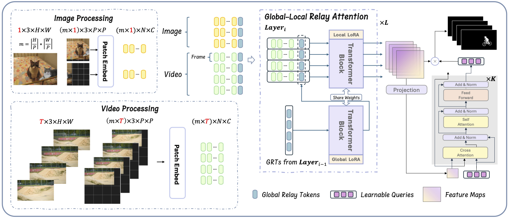
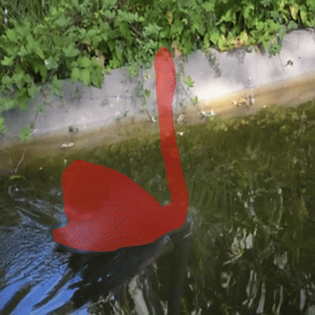
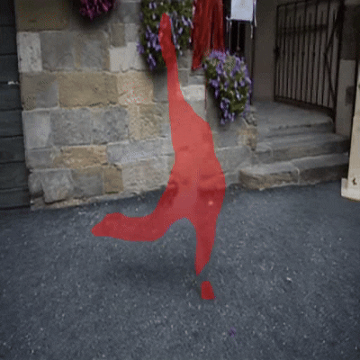
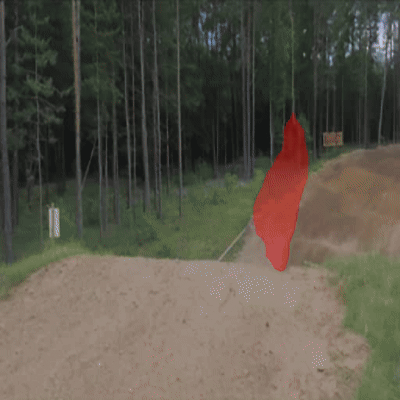

# RelayFormer

[](https://arxiv.org/abs/2508.09459)
[](LICENSE)
[]()
[]()

**RelayFormer: A Unified Local–Global Attention Framework for Scalable Image & Video Manipulation Localization**  
Official PyTorch implementation of our paper:  
> Wen Huang, Jiarui Yang, Tao Dai, et al.  
> _RelayFormer: A Unified Local–Global Attention Framework for Scalable Image and Video Manipulation Localization_  
> [arXiv:2508.09459](https://arxiv.org/abs/2508.09459)

---

## 📌 Introduction
RelayFormer is a modular architecture designed for detecting manipulated regions in both images and videos at dynamic resolution.




---

## 🎥 Demo

### Video Results

Here are qualitative results of RelayFormer on manipulated videos, where specific objects have been removed from the original footage.
The red mask regions indicate the areas predicted by the model as having been removed or altered from the original content.

<table>
  <tr>
    <td align="center">
      <br>Demo 1
    </td>
    <td align="center">
      <br>Demo 2
    </td>
    <td align="center">
      <br>Demo 3
    </td>
  </tr>
  <tr>
    <td align="center">
      <br>Demo 4
    </td>
    <td align="center">
      <br>Demo 5
    </td>
    <td align="center">
      <br>Demo 6
    </td>
  </tr>
</table>


## 📅 Roadmap / TODO

* ✅ **Release pretrained weights** (Relay-ViT) 
* ✅ **Publish inference code** with sample scripts & demo
* [ ] **Publish training code** with full configurations
* [ ] Add documentation for datasets & evaluation


## ⚙️ Installation

```bash
git clone https://github.com/WenOOI/RelayFormer.git
cd RelayFormer

conda create -n vml python=3.9
conda activate vml

pip install imdlbenco
pip install rotary_embedding_torch
```

---

## 🚀 Usage

### 0. Download Pre-trained Weights

#### 0.1 Weights from the paper
You can download the pre-trained weights used in the paper [here](https://drive.google.com/file/d/1CFxwkVAB6_Qq-A8VJlYXJdcABJ26r7xJ/view?usp=drive_link). These weights were trained on the CASIAv2.0 dataset for images and the DAVIS2016 inpainting dataset for videos, allowing the model to handle arbitrary image and video inputs.  

In the original experiments, the two modalities were trained independently to ensure a fair comparison and prevent cross-task interference. However, further tests indicate that joint training of both modalities has minimal impact on performance. These weights are intended primarily for reproducing the results reported in the paper.

#### 0.2 Application-oriented weights
You can download the application-oriented weights [here](https://drive.google.com/file/d/1vLIxt_2xdGoI2voFMOFKsHCpU7EZG3qE/view?usp=sharing).  

These weights are trained on a larger, more diverse dataset, making them better suited for real-world scenarios. Compared to the paper’s weights, they provide improved generalization and robustness across a wider range of images and videos. We plan to release updated versions trained on even broader datasets in the future to further enhance performance for practical applications.


### 1. Inference

Place the images and videos to be detected in a single folder. Update the `input_dir` and `output_dir` paths in `infer.sh` to point to the corresponding directories. Run the following command to generate a folder with the localization results:

```bash
bash infer.sh
```


### 2. Training (Planned Release)

```bash
bash train.sh
```

---

## 📄 Citation

If you use RelayFormer in your research, please cite:

```bibtex
@article{huang2025relayformer,
  title={RelayFormer: A Unified Local-Global Attention Framework for Scalable Image and Video Manipulation Localization},
  author={Huang, Wen and Yang, Jiarui and Dai, Tao and others},
  journal={arXiv preprint arXiv:2508.09459},
  year={2025}
}
```

---

## 🙏 Acknowledgements

We thank the authors of [IMDLBenCo](https://github.com/scu-zjz/imdlbenco) and other open-source projects that made this work possible.
