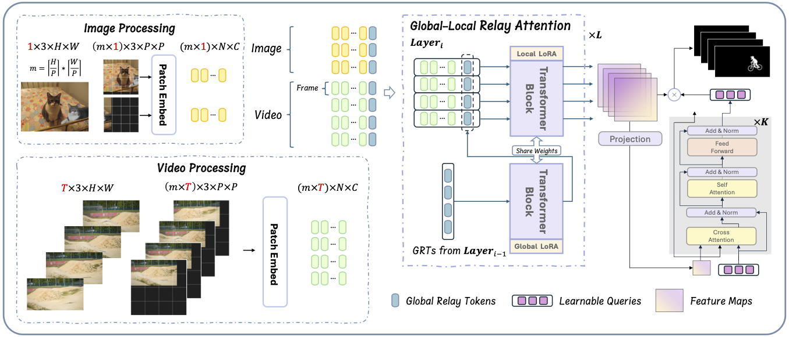
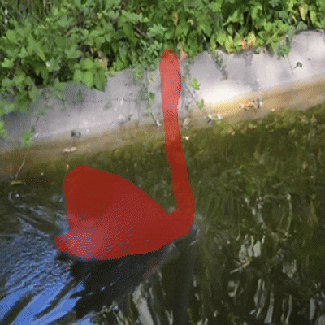
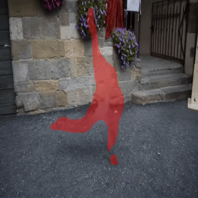
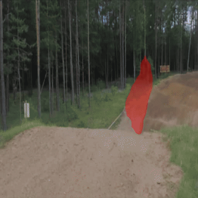

# RelayFormer

[](https://arxiv.org/abs/2508.09459)
[](LICENSE)
[]()
[]()

**RelayFormer: A Unified Local–Global Attention Framework for Scalable Image & Video Manipulation Localization**
Official PyTorch implementation of our paper:

> Wen Huang, Jiarui Yang, Tao Dai, et al.
> _RelayFormer: A Unified Local–Global Attention Framework for Scalable Image and Video Manipulation Localization_
> [arXiv:2508.09459](https://arxiv.org/abs/2508.09459)

This release bundles one model and one data pipeline with ready-to-run **training**,
**testing**, and **inference** for images, videos, or a mix of both.

---

## 📌 Introduction

RelayFormer is a modular architecture for detecting manipulated regions in both images and
videos at dynamic resolution.



---

## 🎥 Demo

Qualitative results on manipulated videos, where specific objects have been removed from the
original footage. The red mask regions indicate the areas the model predicts as removed or altered.

<table>
  <tr>
    <td align="center"><br>Demo 1</td>
    <td align="center"><br>Demo 2</td>
    <td align="center"><br>Demo 3</td>
  </tr>
  <tr>
    <td align="center"><br>Demo 4</td>
    <td align="center"><br>Demo 5</td>
    <td align="center"><br>Demo 6</td>
  </tr>
</table>

---

## 📅 Roadmap

- ✅ Release pretrained weights (Relay-ViT)
- ✅ Inference code with sample scripts & demo
- ✅ Training code with full configurations (image / video / mixed)
- ✅ Documentation for datasets & evaluation
- [ ] Parallel inference for mixed video/image inputs at dynamic resolution

---

## ⚙️ Installation

```bash
conda create -n relayformer python=3.9 && conda activate relayformer
pip install -r requirements.txt
```

---

## 📦 Pretrained weights

**ViT backbone** — pass `--vit_pretrain_path <ckpt>` (MAE / `.bin` / `.pth`; the register-token
`pos_embed` is auto-adapted). If omitted, timm downloads ImageNet weights automatically.

**RelayFormer checkpoints**

- **Paper weights** — [download](https://drive.google.com/file/d/1CFxwkVAB6_Qq-A8VJlYXJdcABJ26r7xJ/view?usp=drive_link).
  Trained on CASIAv2.0 (images) and the DAVIS2016 inpainting dataset (videos), so the model handles
  arbitrary image and video inputs. In the paper, the two modalities were trained independently to
  ensure a fair comparison and avoid cross-task interference; further tests show joint training has
  minimal impact on performance. These weights are intended primarily for reproducing the paper.
- **Application-oriented weights** — [download](https://drive.google.com/file/d/1vLIxt_2xdGoI2voFMOFKsHCpU7EZG3qE/view?usp=sharing).
  Trained on a larger, more diverse dataset for better generalization and robustness across a wider
  range of real-world images and videos.

---

## 🗂 Layout

```
RelayFormer_release/
├── models/
│   ├── GLoRA_vit.py        # LoRA + 4D-RoPE ViT blocks
│   └── RelayFormer.py      # RelayFormer (IMDLBenCo-registered; train + inference forward)
├── datasets/
│   ├── hybrid_dataset.py   # MixedImageVideoDataset (train/test: image / video / mixed)
│   └── inference_dataset.py# InferenceDataset (scan a folder of images / videos)
├── configs/                # train_image / train_video / train_mixed / test_datasets
├── scripts/                # train_*.sh / test.sh / infer.sh
├── train.py                # training entry
├── test.py                 # evaluation entry
├── infer.py                # inference entry
├── requirements.txt
└── LICENSE
```

---

## 🚀 Usage

### 1. Training (image / video / mixed)

The training mode is decided entirely by the dataset config — a flat list of entries:

```json
[
  ["ManiDataset",  "/path/to/CASIA2.0"],            // image dir with Tp/ and Gt/
  ["JsonDataset",  "/path/to/list.json"],           // image list: [[tp, gt], ...]
  ["VideoDataset", "/path/to/DAVIS", ["OPN","DVI"]] // video dir + manipulation methods
]
```

| Entries present                    | Mode        | Script                    |
|------------------------------------|-------------|---------------------------|
| only `ManiDataset` / `JsonDataset` | pure image  | `scripts/train_image.sh`  |
| only `VideoDataset`                | pure video  | `scripts/train_video.sh`  |
| both                               | mixed       | `scripts/train_mixed.sh`  |

```bash
bash scripts/train_image.sh   # or train_video.sh / train_mixed.sh
```

Edit `configs/*.json` to point at your data, then adjust the `.sh` flags.

### 2. Testing

Test config is a dict `{name: dataset_entry}` so each set (image or video) is reported separately:

```json
{
  "CASIA1.0": ["ManiDataset",  "/path/to/CASIA1.0"],
  "MOSE":     ["VideoDataset", "/path/to/MOSE", ["E2FGVI", "FuseFormer", "STTN"]]
}
```

```bash
# set --checkpoint_path inside the script first
bash scripts/test.sh
```

### 3. Inference

Point at a single file or a folder of images / videos; results (mask + red overlay, plus
reassembled videos for video inputs) are written per sample to `--output_dir`.

```bash
python infer.py \
    --model_path /path/to/checkpoint-best.pth \
    --input_dir  /path/to/input \
    --output_dir ./output_infer \
    --input_size 1024
# or: bash scripts/infer.sh
```

---

## ⚙️ Key options

| Flag | Meaning |
|------|---------|
| `--image_size` | Working resolution; model `input_size` is forced to match. Default **1024**. |
| `--grid_size` | Max NxN tiling. `0` (default) auto-derives as `input_size // 512` (1024→2). Pin to `2` to reproduce a fixed 2x2 tiling at 512. |
| `--patch_size` / `--feature_patch_size` | Image- / feature-space patch tiling. 1024 preset: `528` / `33`. 512 preset: `272` / `17`. |
| `--vit_pretrain_path` | ViT checkpoint to load (else timm auto-download). |
| `--edge_mask_width` | Enables the edge-aware BCE loss (weight `--edge_lambda`, default 20). |
| `--clip_len` | Frames per video clip (images are single-frame, `clip_len=1`). |
| `--merge_lora` | (test) Fuse LoRA into base weights for faster inference. |

**Resolution presets**

| `input_size` | `patch_size` | `feature_patch_size` | `grid_size` |
|--------------|--------------|----------------------|-------------|
| 1024 (default) | 528 | 33 | 2 (auto) |
| 512          | 272 | 17 | 2 (pass `--grid_size 2`) |

---

## 📄 Citation

If you use RelayFormer in your research, please cite:

```bibtex
@article{huang2025relayformer,
  title={RelayFormer: A Unified Local-Global Attention Framework for Scalable Image and Video Manipulation Localization},
  author={Huang, Wen and Yang, Jiarui and Dai, Tao and Li, Jiawei and Zhan, Shaoxiong and Wang, Bin and Xia, Shu-Tao},
  journal={arXiv preprint arXiv:2508.09459},
  year={2025}
}
```

---

## 🙏 Acknowledgements

Built on [IMDLBenCo](https://github.com/scu-zjz/IMDLBenCo). We thank the authors and the other
open-source projects that made this work possible.
